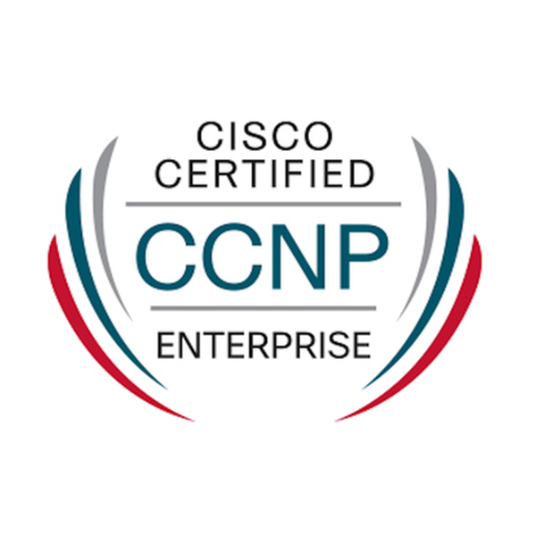
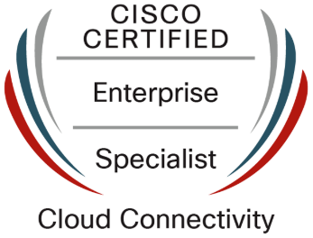
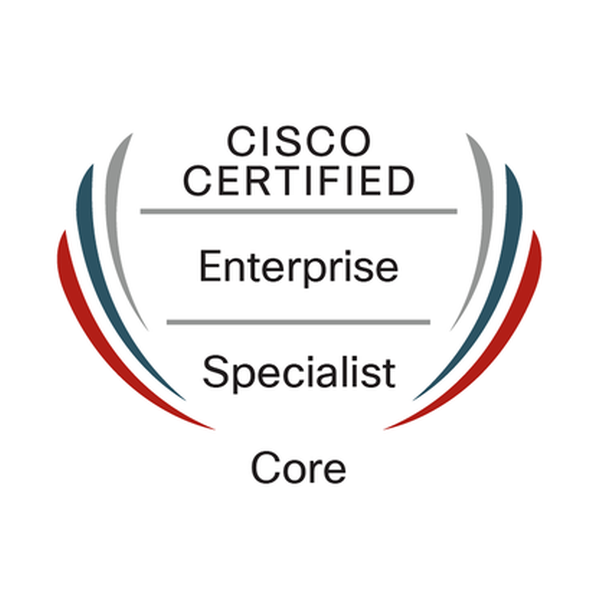
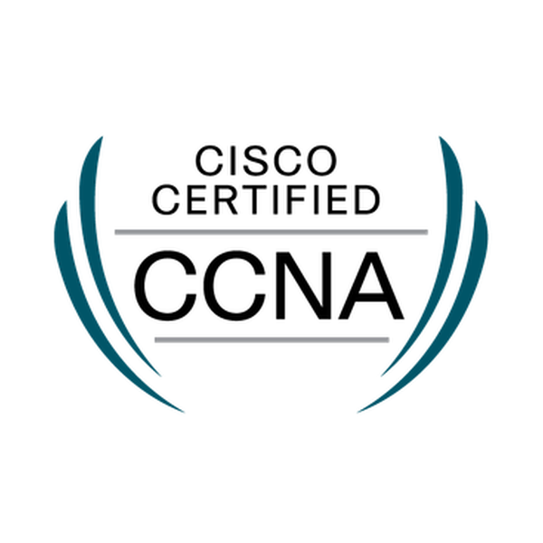
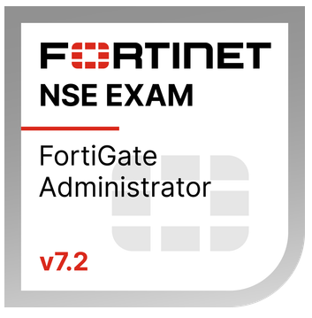

# Hi, I'm Sid 👋

**Network Engineer | CCNP Enterprise | AWS / Cloud Security Transition**

I'm a Network Engineer with hands-on experience in **enterprise networking, SD-WAN, security operations, and cloud-connected infrastructure**. My work includes **AWS networking, hybrid connectivity, firewall hardening, WAF, Zscaler, and production troubleshooting** across enterprise environments.

I use this GitHub to document **homelab builds, AWS labs, security projects, and infrastructure experiments** that support my transition into **cloud, cloud security, and infrastructure engineering roles**.

  
  
  
  
  
  

---

## 🚀 What I Work On

* Enterprise network engineering and security operations
* SD-WAN, branch connectivity, and hybrid network design
* AWS networking and cloud-connected infrastructure
* Firewall policy hardening, secure access, and traffic control
* Homelab projects focused on logging, reverse proxy, identity, and monitoring

---

## 🎯 Current Focus

* Building **cloud / network security portfolio projects**
* Strengthening **AWS architecture and infrastructure skills**
* Studying for **AWS Solutions Architect Associate**
* Exploring **network automation, logging pipelines, and security monitoring**

---

## 🛠️ Tech Stack

### Networking & Infrastructure

* Cisco routing and switching
* Enterprise LAN/WAN
* SD-WAN
* VLANs, routing, VPNs, ACLs
* Hybrid connectivity and branch networking

### Security

* Fortinet
* Zscaler
* WAF
* Firewall policy hardening
* Reverse proxy security
* Security monitoring and log analysis

### Cloud

* AWS VPC
* EC2
* S3
* ALB
* Route 53
* IAM
* Hybrid cloud networking

### Homelab / Tools

* Proxmox
* Wazuh
* NetBox
* Nginx Proxy Manager
* Authentik
* Grafana
* OPNsense
* Linux
* GitHub

---

## 📜 Certifications

* **Cisco CCNP Enterprise**
* **Cisco Enterprise Cloud Connectivity Specialist**
* **Cisco Enterprise Core Specialist**
* **Cisco Certified Network Associate**
* **Fortinet NSE 4**
* **Cato Certificates**

---

## 📂 Featured Projects

### 🔹 Homelab Network Core

Core homelab environment built to simulate real-world infrastructure and security services. Includes network segmentation, identity, reverse proxy, monitoring, and self-hosted tooling.

### 🔹 AWS Hybrid Connectivity Lab

Lab environment focused on AWS networking, routing, and hybrid connectivity scenarios. Used to explore cloud networking design, secure access paths, and integration between on-prem and AWS-hosted services.

### 🔹 SIEM Log Pipeline Lab

Security monitoring lab focused on collecting, forwarding, and analyzing logs from infrastructure and security tools. Built to improve visibility, troubleshooting, and security operations workflows.

### 🔹 WAF / Reverse Proxy Security Lab

Lab focused on reverse proxy hardening, secure publishing of internal services, access control, and web application protection concepts.

---

## 📌 GitHub Goals

This GitHub is where I document:

* Infrastructure and networking labs
* Cloud and security learning projects
* Hands-on AWS experiments
* Homelab architecture and operational notes
* Practical projects that reflect the direction I’m building toward professionally

---

## 🤝 Connect With Me

If you're interested in **networking, cloud infrastructure, hybrid connectivity, or cloud security**, feel free to explore the projects here.
